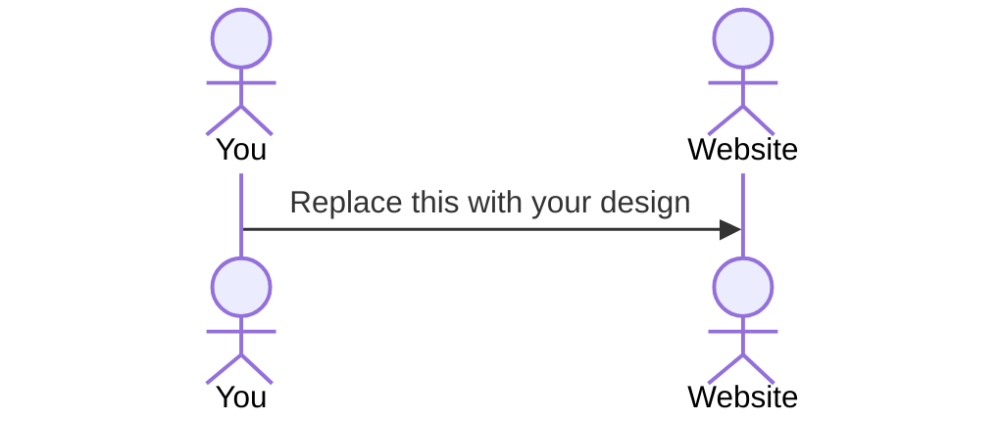

# Chatty

[My Notes](notes.md)

This application aims to help users learn a new language through dynamic practice and conversation. Users have the opportunity to chat with a personalized chatbot that introduces new words in the target language, stores their progress, and provides language learning tasks of an appropriate difficulty. Users are also able to look at lists of vocabulary they have learned and complete short reading comprehension questions that align with where they are at in the learning process. Studies show that a language is best learned through active conversation - in the age of multilingual AI, why aren't we all doing it this way?

### Elevator pitch

Everybody knows that we learn languages best by chatting with real speakers - not textbooks, not repetitive multiple choice questions. Organic conversations with real feedback and real participation are effective but often hard to find, though. So how about we create them? The most current AI-driven Text-to-Speech and Speech-to-Speech models are proficient in dozens of languages already, and provide the perfect foundation for a live, intelligent chat partner who can really help you learn. Chatty app is the first place to implement this. No need to study, no need to stress, just chat :)

### Design

Lorem ipsum dolor sit amet, consectetur adipiscing elit, sed do eiusmod tempor incididunt ut labore et dolore magna aliqua. Ut enim ad minim veniam, quis nostrud exercitation ullamco laboris nisi ut aliquip ex ea commodo consequat. Duis aute irure dolor in reprehenderit in voluptate velit esse cillum dolore eu fugiat nulla pariatur. Excepteur sint occaecat cupidatat non proident, sunt in culpa qui officia deserunt mollit anim id est laborum.

### Key features

- Authentication allows users to securely create accounts and access information from previous sessions
- Chat feature backed by an LLM and a speech-to-speech provider enables users to speak and listen live and get live feedback 
- Database stores auth data as well as learning progress, including vocab and grammar skills, for each user
- Different feedback levels allow users to customize whether they want a low-stakes practice experience or a rigorous constructive criticism session
- Dark theme and light theme are offered to improve visual experience

### Technologies

I am going to use the required technologies in the following ways.

- **HTML** - This will provide the backbone of the page. There will be 4 pages: a login/signup page, a progress page that shows the skills they have mastered and in progress, a chat page that allows them to talk live with an AI, and a challenge page that shows a daily task.
- **CSS** - CSS will implement the light theme and dark theme, as well as the other color scheme elements. Buttons will have my signature animated hover gradient to make the site feel high-tech and interactive.
- **React** - React components allow users to switch between the HTML pages via buttons. Vocab words on the progress page are react components as well, so when you click on them it shows the definition and changes the color depending on how well you have mastered it.  
- **Service** - The app will connect to several external APIs, including Gemini or GPT as the LLM providing text, and ElevenLabs to provide the text-to-speech service. The ElevenLabs v2 model is cheap and supports 29 languages. It can be accessed here: [Link](https://elevenlabs.io/docs/overview/models).
- **DB/Login** - The authentication page will connect to the database through the backend to securely store logins, alongside progress scores and transcripts of that user's conversations. 
- **WebSocket** - ElevenLabs uses WebSocket to facilitate the live communication between the user and the LLM. That is how real-time conversation is made possible. I could also implement a leaderboard that shows other users who have practiced today based on participation levels that updates in real-time using WebSocket.

## 🚀 Specification Deliverable

> [!NOTE]
> Fill in this sections as the submission artifact for this deliverable. You can refer to this [example](https://github.com/webprogramming260/startup-example/blob/main/README.md) for inspiration.

For this deliverable I did the following. I checked the box `[x]` and added a description for things I completed.

- [x] I completed the prerequisites for this deliverable (Git commit requirement)
- [x] Proper use of Markdown
- [x] A concise and compelling elevator pitch
- [x] Description of key features
- [x] Description of how you will use each technology including your 3rd party API and use of WebSocket
- [ ] One or more rough sketches of your application. Images must be embedded in this file using Markdown image references.

## 🚀 AWS deliverable

For this deliverable I did the following. I checked the box `[x]` and added a description for things I completed.

- [ ] **Rented EC2 server** - I did not complete this part of the deliverable.
- [ ] **Leased domain name** - I did not complete this part of the deliverable.
- [ ] **Server accessible** from my domain: [https://yourdomainnamehere.click](https://yourdomainnamehere.click) - I did not complete this part of the deliverable.

## 🚀 HTML deliverable

For this deliverable I did the following. I checked the box `[x]` and added a description for things I completed.

- [ ] I completed the prerequisites for this deliverable (Simon deployed, GitHub link, Git commits)
- [ ] **HTML pages** - I did not complete this part of the deliverable.
- [ ] **Proper HTML element usage** - I did not complete this part of the deliverable.
- [ ] **Links** - I did not complete this part of the deliverable.
- [ ] **Text** - I did not complete this part of the deliverable.
- [ ] **3rd party API placeholder** - I did not complete this part of the deliverable.
- [ ] **Images** - I did not complete this part of the deliverable.
- [ ] **Login placeholder** - I did not complete this part of the deliverable.
- [ ] **DB data placeholder** - I did not complete this part of the deliverable.
- [ ] **WebSocket placeholder** - I did not complete this part of the deliverable.

## 🚀 CSS deliverable

For this deliverable I did the following. I checked the box `[x]` and added a description for things I completed.

- [ ] I completed the prerequisites for this deliverable (Simon deployed, GitHub link, Git commits)
- [ ] **Visually appealing colors and layout. No overflowing elements.** - I did not complete this part of the deliverable.
- [ ] **Use of a CSS framework** - I did not complete this part of the deliverable.
- [ ] **All visual elements styled using CSS** - I did not complete this part of the deliverable.
- [ ] **Responsive to window resizing using flexbox and/or grid display** - I did not complete this part of the deliverable.
- [ ] **Use of a imported font** - I did not complete this part of the deliverable.
- [ ] **Use of different types of selectors including element, class, ID, and pseudo selectors** - I did not complete this part of the deliverable.

## 🚀 React part 1: Routing deliverable

For this deliverable I did the following. I checked the box `[x]` and added a description for things I completed.

- [ ] I completed the prerequisites for this deliverable (Simon deployed, GitHub link, Git commits)
- [ ] **Bundled using Vite** - I did not complete this part of the deliverable.
- [ ] **Components** - I did not complete this part of the deliverable.
- [ ] **Router** - I did not complete this part of the deliverable.

## 🚀 React part 2: Reactivity deliverable

For this deliverable I did the following. I checked the box `[x]` and added a description for things I completed.

- [ ] I completed the prerequisites for this deliverable (Simon deployed, GitHub link, Git commits)
- [ ] **All functionality implemented or mocked out** - I did not complete this part of the deliverable.
- [ ] **Hooks** - I did not complete this part of the deliverable.

## 🚀 Service deliverable

For this deliverable I did the following. I checked the box `[x]` and added a description for things I completed.

- [ ] I completed the prerequisites for this deliverable (Simon deployed, GitHub link, Git commits)
- [ ] **Node.js/Express HTTP service** - I did not complete this part of the deliverable.
- [ ] **Static middleware for frontend** - I did not complete this part of the deliverable.
- [ ] **Calls to third party endpoints** - I did not complete this part of the deliverable.
- [ ] **Backend service endpoints** - I did not complete this part of the deliverable.
- [ ] **Frontend calls service endpoints** - I did not complete this part of the deliverable.
- [ ] **Supports registration, login, logout, and restricted endpoint** - I did not complete this part of the deliverable.
- [ ] **Uses BCrypt to hash passwords** - I did not complete this part of the deliverable.

## 🚀 DB deliverable

For this deliverable I did the following. I checked the box `[x]` and added a description for things I completed.

- [ ] I completed the prerequisites for this deliverable (Simon deployed, GitHub link, Git commits)
- [ ] **Stores data in MongoDB** - I did not complete this part of the deliverable.
- [ ] **Stores credentials in MongoDB** - I did not complete this part of the deliverable.

## 🚀 WebSocket deliverable

For this deliverable I did the following. I checked the box `[x]` and added a description for things I completed.

- [ ] I completed the prerequisites for this deliverable (Simon deployed, GitHub link, Git commits)
- [ ] **Backend listens for WebSocket connection** - I did not complete this part of the deliverable.
- [ ] **Frontend makes WebSocket connection** - I did not complete this part of the deliverable.
- [ ] **Data sent over WebSocket connection** - I did not complete this part of the deliverable.
- [ ] **WebSocket data displayed** - I did not complete this part of the deliverable.
- [ ] **Application is fully functional** - I did not complete this part of the deliverable.
